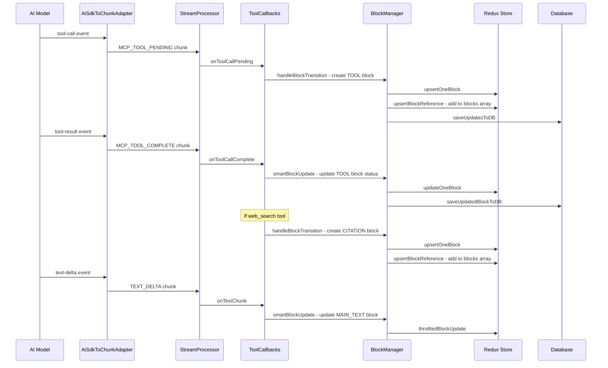

# Cherry Studio 多轮工具调用信息块排序保存逻辑分析

> 本文档详细分析 Cherry Studio 如何实现多轮工具迭代调用时信息块的按时间序列排序

## 1. 概述

Cherry Studio 采用了一套完整的消息块(MessageBlock)系统来处理多轮对话中的各种内容类型，包括文本、思考过程、工具调用、引用等。本文档分析其信息块的排序保存逻辑。

## 2. 核心数据结构

### 2.1 MessageBlock 类型枚举

```typescript
// 文件: src/renderer/src/types/newMessage.ts
enum MessageBlockType {
  UNKNOWN = 'unknown',      // 未知类型，用于占位
  MAIN_TEXT = 'main_text',  // 主要文本内容
  THINKING = 'thinking',    // 思考过程
  TRANSLATION = 'translation', // 翻译
  IMAGE = 'image',          // 图片内容
  CODE = 'code',            // 代码块
  TOOL = 'tool',            // 工具调用
  FILE = 'file',            // 文件内容
  ERROR = 'error',          // 错误信息
  CITATION = 'citation',    // 引用(网络搜索/知识库)
  VIDEO = 'video',          // 视频内容
  COMPACT = 'compact'       // 紧凑命令响应
}
```

### 2.2 MessageBlock 状态

```typescript
enum MessageBlockStatus {
  PENDING = 'pending',       // 等待处理
  PROCESSING = 'processing', // 正在处理
  STREAMING = 'streaming',   // 正在流式接收
  SUCCESS = 'success',       // 处理成功
  ERROR = 'error',           // 处理错误
  PAUSED = 'paused'          // 处理暂停
}
```

### 2.3 消息与块的关系

```typescript
// Message 结构
interface Message {
  id: string
  role: 'user' | 'assistant' | 'system'
  topicId: string
  // ... 其他字段
  
  // 块集合 - 存储块ID数组，保持顺序
  blocks: MessageBlock['id'][]
}
```

**关键设计**：Message 中的 `blocks` 字段是一个 ID 数组，通过数组顺序来维护块的排列顺序。

## 3. 块排序规则

### 3.1 核心排序机制

**块的添加通过两个步骤完成**：

1. **`handleBlockTransition`** 调用 `updateMessage` 的 `blockInstruction`
2. **`updateMessage` reducer** 将块 push 到末尾

```typescript
// BlockManager.ts - handleBlockTransition
async handleBlockTransition(newBlock: MessageBlock, newBlockType: MessageBlockType) {
  // 步骤1: 通过 blockInstruction 添加块
  this.deps.dispatch(
    newMessagesActions.updateMessage({
      topicId: this.deps.topicId,
      messageId: this.deps.assistantMsgId,
      updates: { blockInstruction: { id: newBlock.id } }  // 不指定 position
    })
  )
  // ...
}

// newMessage.ts - updateMessage reducer
updateMessage(state, action) {
  if (blockInstruction) {
    const { id: blockIdToAdd, position } = blockInstruction
    if (!currentBlocks.includes(blockIdToAdd)) {
      if (typeof position === 'number' && position >= 0) {
        currentBlocks.splice(position, 0, blockIdToAdd)  // 指定位置插入
      } else {
        currentBlocks.push(blockIdToAdd)  // 默认：追加到末尾！
      }
    }
  }
}
```

### 3.2 关键：所有块按时间顺序追加

**实际排序规则：所有新块都追加到数组末尾，保持时间序列顺序。**

| 块类型 | 插入位置 | 说明 |
|--------|----------|------|
| 所有类型 | 数组末尾 | 按创建时间顺序追加 |

> 注意：`upsertBlockReference` 中的 THINKING 前置逻辑是备用机制，在正常流式处理中不会生效，因为 `updateMessage` 先执行完毕后块已存在。

## 4. 多轮工具调用处理流程

### 4.1 整体架构

```
AI SDK Stream
    ↓
AiSdkToChunkAdapter (转换层)
    ↓
StreamProcessor (分发器)
    ↓
Callbacks (各类回调处理器)
    ↓
BlockManager (块状态管理)
    ↓
Redux Store + Database (持久化)
```

### 4.2 Chunk 类型与块类型映射

```typescript
// 文件: src/renderer/src/types/chunk.ts
enum ChunkType {
  // 文本相关
  TEXT_START = 'text.start',
  TEXT_DELTA = 'text.delta',
  TEXT_COMPLETE = 'text.complete',
  
  // 思考相关
  THINKING_START = 'thinking.start',
  THINKING_DELTA = 'thinking.delta',
  THINKING_COMPLETE = 'thinking.complete',
  
  // 工具相关
  MCP_TOOL_CREATED = 'mcp_tool_created',
  MCP_TOOL_PENDING = 'mcp_tool_pending',
  MCP_TOOL_IN_PROGRESS = 'mcp_tool_in_progress',
  MCP_TOOL_COMPLETE = 'mcp_tool_complete',
  
  // 搜索相关
  WEB_SEARCH_IN_PROGRESS = 'web_search_in_progress',
  WEB_SEARCH_COMPLETE = 'web_search_complete',
  LLM_WEB_SEARCH_COMPLETE = 'llm_websearch_complete',
  
  // 图片相关
  IMAGE_CREATED = 'image.created',
  IMAGE_COMPLETE = 'image.complete',
  
  // 生命周期
  LLM_RESPONSE_CREATED = 'llm_response_created',
  BLOCK_COMPLETE = 'block_complete',
  ERROR = 'error'
}
```

### 4.3 工具调用处理 (toolCallbacks.ts)

```typescript
// 文件: src/renderer/src/services/messageStreaming/callbacks/toolCallbacks.ts

const createToolCallbacks = (deps: ToolCallbacksDependencies) => {
  // 维护工具调用ID到块ID的映射
  const toolCallIdToBlockIdMap = new Map<string, string>()
  let toolBlockId: string | null = null
  let citationBlockId: string | null = null

  return {
    // 工具调用开始(pending状态)
    onToolCallPending: (toolResponse: MCPToolResponse) => {
      if (blockManager.hasInitialPlaceholder) {
        // 使用占位块
        const changes = {
          type: MessageBlockType.TOOL,
          status: MessageBlockStatus.PENDING,
          toolName: toolResponse.tool.name,
          metadata: { rawMcpToolResponse: toolResponse }
        }
        toolBlockId = blockManager.initialPlaceholderBlockId!
        blockManager.smartBlockUpdate(toolBlockId, changes, MessageBlockType.TOOL)
        toolCallIdToBlockIdMap.set(toolResponse.id, toolBlockId)
      } else {
        // 创建新的工具块
        const toolBlock = createToolBlock(assistantMsgId, toolResponse.id, {
          toolName: toolResponse.tool.name,
          status: MessageBlockStatus.PENDING,
          metadata: { rawMcpToolResponse: toolResponse }
        })
        toolBlockId = toolBlock.id
        blockManager.handleBlockTransition(toolBlock, MessageBlockType.TOOL)
        toolCallIdToBlockIdMap.set(toolResponse.id, toolBlock.id)
      }
    },

    // 工具调用完成
    onToolCallComplete: (toolResponse: MCPToolResponse) => {
      const existingBlockId = toolCallIdToBlockIdMap.get(toolResponse.id)
      toolCallIdToBlockIdMap.delete(toolResponse.id)

      if (toolResponse.status === 'done' || toolResponse.status === 'error') {
        const finalStatus = toolResponse.status === 'done' 
          ? MessageBlockStatus.SUCCESS 
          : MessageBlockStatus.ERROR

        const changes = {
          content: toolResponse.response,
          status: finalStatus,
          metadata: { rawMcpToolResponse: toolResponse }
        }
        blockManager.smartBlockUpdate(existingBlockId, changes, MessageBlockType.TOOL, true)
        
        // 如果是网络搜索工具，创建引用块
        if (toolResponse.tool.name === 'builtin_web_search' && toolResponse.response) {
          const citationBlock = createCitationBlock(assistantMsgId, {
            response: { results: toolResponse.response, source: WebSearchSource.WEBSEARCH }
          }, { status: MessageBlockStatus.SUCCESS })
          citationBlockId = citationBlock.id
          blockManager.handleBlockTransition(citationBlock, MessageBlockType.CITATION)
        }
      }
    }
  }
}
```

### 4.4 工具调用 Chunk 处理 (handleToolCallChunk.ts)

```typescript
// 文件: src/renderer/src/aiCore/chunk/handleToolCallChunk.ts

class ToolCallChunkHandler {
  // 全局活跃工具调用映射
  private static globalActiveToolCalls = new Map<string, ToolcallsMap>()

  // 处理工具调用事件
  handleToolCall(chunk: ToolCallChunk) {
    const { toolCallId, toolName, input: args } = chunk
    
    // 确定工具类型
    let tool: BaseTool
    if (providerExecuted) {
      tool = { id: toolCallId, name: toolName, type: 'provider' }
    } else if (toolName.startsWith('builtin_')) {
      tool = { id: toolCallId, name: toolName, type: 'builtin' }
    } else {
      // MCP工具
      tool = this.mcpTools.find(t => t.name === toolName) || 
             { id: toolCallId, name: toolName, type: 'provider' }
    }

    this.addActiveToolCall(toolCallId, { toolCallId, toolName, args, tool })
    
    // 发送 PENDING chunk
    this.onChunk({
      type: ChunkType.MCP_TOOL_PENDING,
      responses: [{
        id: toolCallId,
        tool,
        arguments: args,
        status: 'pending',
        toolCallId
      }]
    })
  }

  // 处理工具结果
  handleToolResult(chunk: ToolResultChunk) {
    const { toolCallId, output } = chunk
    const toolCallInfo = this.activeToolCalls.get(toolCallId)
    
    const toolResponse = {
      id: toolCallInfo.toolCallId,
      tool: toolCallInfo.tool,
      arguments: input,
      status: 'done',
      response: output,
      toolCallId
    }

    this.activeToolCalls.delete(toolCallId)
    
    // 发送完成 chunk
    this.onChunk({
      type: ChunkType.MCP_TOOL_COMPLETE,
      responses: [toolResponse]
    })
  }
}
```

## 5. BlockManager 核心逻辑

### 5.1 BlockManager 结构

```typescript
// 文件: src/renderer/src/services/messageStreaming/BlockManager.ts

class BlockManager {
  // 当前活跃块信息
  private _activeBlockInfo: ActiveBlockInfo | null = null
  // 上一个块类型(用于错误处理和块类型转换判断)
  private _lastBlockType: MessageBlockType | null = null

  // 智能更新策略
  smartBlockUpdate(
    blockId: string,
    changes: Partial<MessageBlock>,
    blockType: MessageBlockType,
    isComplete: boolean = false
  ) {
    const isBlockTypeChanged = this._lastBlockType !== null && 
                               this._lastBlockType !== blockType

    if (isBlockTypeChanged || isComplete) {
      // 块类型改变或完成时，立即更新
      if (isBlockTypeChanged && this._activeBlockInfo) {
        this.deps.cancelThrottledBlockUpdate(this._activeBlockInfo.id)
      }
      if (isComplete) {
        this.deps.cancelThrottledBlockUpdate(blockId)
        this._activeBlockInfo = null
      } else {
        this._activeBlockInfo = { id: blockId, type: blockType }
      }
      this.deps.dispatch(updateOneBlock({ id: blockId, changes }))
      this.deps.saveUpdatedBlockToDB(blockId, ...)
      this._lastBlockType = blockType
    } else {
      // 同类型流式更新时使用节流
      this._activeBlockInfo = { id: blockId, type: blockType }
      this.deps.throttledBlockUpdate(blockId, changes)
    }
  }

  // 处理块转换(创建新块)
  async handleBlockTransition(newBlock: MessageBlock, newBlockType: MessageBlockType) {
    this._lastBlockType = newBlockType
    this._activeBlockInfo = { id: newBlock.id, type: newBlockType }

    // 更新消息中的块列表
    this.deps.dispatch(newMessagesActions.updateMessage({
      topicId: this.deps.topicId,
      messageId: this.deps.assistantMsgId,
      updates: { blockInstruction: { id: newBlock.id } }
    }))
    
    // 添加块到 store
    this.deps.dispatch(upsertOneBlock(newBlock))
    
    // 触发排序逻辑
    this.deps.dispatch(newMessagesActions.upsertBlockReference({
      messageId: this.deps.assistantMsgId,
      blockId: newBlock.id,
      status: newBlock.status,
      blockType: newBlock.type  // 这里传入块类型，排序逻辑在 reducer 中
    }))

    // 持久化到数据库
    await this.deps.saveUpdatesToDB(...)
  }
}
```

### 5.2 节流更新机制

```typescript
// 文件: src/renderer/src/store/thunk/messageThunk.ts

// 使用 LRU Cache 管理节流器
const blockUpdateThrottlers = new LRUCache<string, ReturnType<typeof throttle>>({
  max: 100,
  ttl: 1000 * 60 * 5
})

const getBlockThrottler = (id: string) => {
  if (!blockUpdateThrottlers.has(id)) {
    const throttler = throttle(async (blockUpdate: any) => {
      const rafId = requestAnimationFrame(() => {
        store.dispatch(updateOneBlock({ id, changes: blockUpdate }))
      })
      await updateSingleBlockV2(id, blockUpdate)
    }, 150)  // 150ms 节流间隔
    
    blockUpdateThrottlers.set(id, throttler)
  }
  return blockUpdateThrottlers.get(id)!
}
```

## 6. 多轮工具调用的完整流程

### 6.1 时序图



### 6.2 典型的块顺序示例

对于一个包含思考、工具调用和文本回复的助手消息：

```
Message.blocks = [
  'thinking-block-1',    // 思考块(始终在最前)
  'tool-block-1',        // 第一个工具调用
  'citation-block-1',    // 第一个工具的引用结果
  'tool-block-2',        // 第二个工具调用
  'citation-block-2',    // 第二个工具的引用结果
  'main-text-block-1'    // 主文本回复
]
```

## 7. 数据持久化

### 7.1 存储结构

- **消息存储**: `db.topics` - 每个话题包含完整的消息列表
- **块存储**: `db.message_blocks` - 独立存储所有消息块

### 7.2 更新策略

```typescript
// 流式更新时使用节流
const saveUpdatedBlockToDB = async (blockId, messageId, topicId, getState) => {
  const blockToSave = getState().messageBlocks.entities[blockId]
  await saveUpdatesToDB(messageId, topicId, {}, [blockToSave])
}

// 块转换时立即保存
const saveUpdatesToDB = async (messageId, topicId, messageUpdates, blocksToUpdate) => {
  await updateExistingMessageAndBlocksInDB({
    id: messageId,
    topicId,
    ...messageUpdates
  }, blocksToUpdate)
}
```

## 8. 关键设计要点

### 8.1 占位块机制

当 LLM 响应开始时，会创建一个 `UNKNOWN` 类型的占位块：

```typescript
onLLMResponseCreated: async () => {
  const baseBlock = createBaseMessageBlock(assistantMsgId, MessageBlockType.UNKNOWN, {
    status: MessageBlockStatus.PROCESSING
  })
  await blockManager.handleBlockTransition(baseBlock, MessageBlockType.UNKNOWN)
}
```

后续第一个实际内容块会复用这个占位块：

```typescript
if (blockManager.hasInitialPlaceholder) {
  // 直接更新占位块的类型和内容
  const changes = { type: MessageBlockType.MAIN_TEXT, content: '', ... }
  blockManager.smartBlockUpdate(placeholderBlockId, changes, ...)
}
```

### 8.2 块类型转换检测

BlockManager 通过 `lastBlockType` 跟踪块类型变化：

```typescript
const isBlockTypeChanged = this._lastBlockType !== null && 
                           this._lastBlockType !== blockType

if (isBlockTypeChanged) {
  // 取消上一个块的节流更新
  this.deps.cancelThrottledBlockUpdate(this._activeBlockInfo.id)
  // 立即同步当前更新
  this.deps.dispatch(updateOneBlock({ id: blockId, changes }))
}
```

### 8.3 工具调用追踪

使用 Map 结构追踪工具调用：

```typescript
// 全局追踪(跨实例共享)
private static globalActiveToolCalls = new Map<string, ToolcallsMap>()

// 实例级追踪(块ID映射)
const toolCallIdToBlockIdMap = new Map<string, string>()
```

## 9. 总结

Cherry Studio 的消息块排序保存逻辑具有以下特点：

1. **类型优先排序**: THINKING 块始终放在最前面，其他块按创建顺序追加
2. **智能更新策略**: 块类型改变或完成时立即更新，同类型流式时节流更新
3. **占位块机制**: 避免频繁创建/删除块，提高性能
4. **分层架构**: Chunk(传输层) → Callbacks(业务层) → BlockManager(状态层) → Store(持久层)
5. **工具调用追踪**: 通过 Map 结构关联工具调用ID与块ID
6. **引用块关联**: 工具完成后自动创建相关的 Citation 块

这套设计使得多轮工具调用中的各种信息块能够有序地呈现给用户，同时保证了良好的性能和数据一致性。