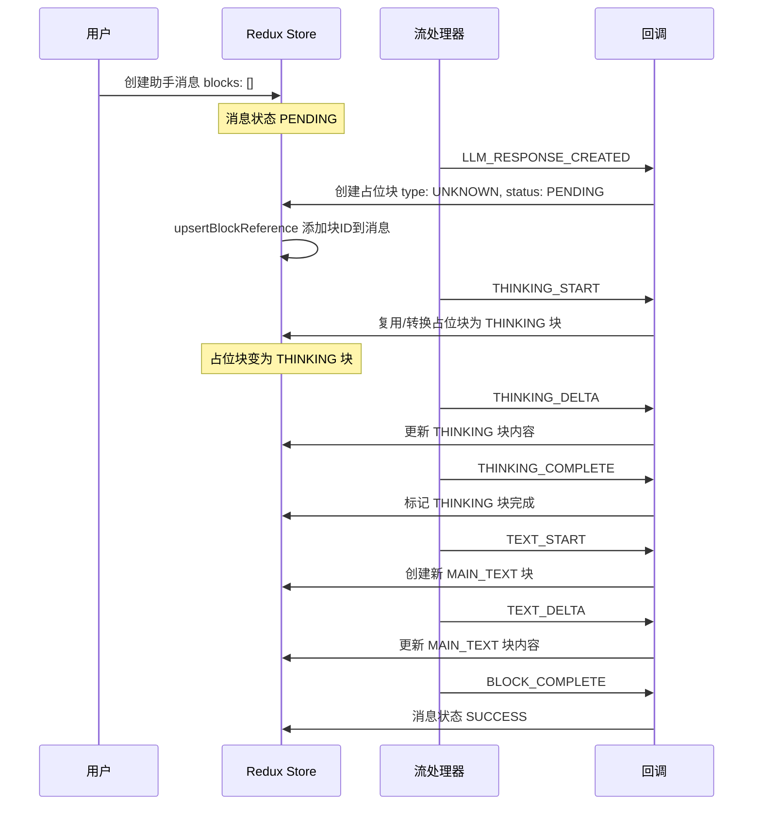
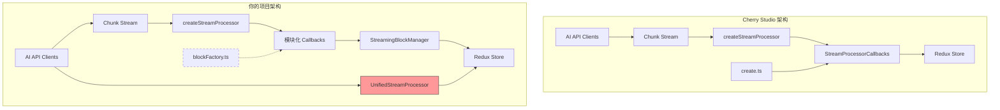

# Cherry Studio 占位块处理逻辑对比分析

## 一、Cherry Studio 完整占位块处理逻辑

### 1.1 核心类型定义

Cherry Studio 在 [`newMessage.ts`](docs/参考项目/cherry-studio-main/src/renderer/src/types/newMessage.ts) 中定义了：

```typescript
// 占位符块类型
export interface PlaceholderMessageBlock extends BaseMessageBlock {
  type: MessageBlockType.UNKNOWN  // 使用 UNKNOWN 作为占位符标识
}

// 消息块联合类型
export type MessageBlock =
  | PlaceholderMessageBlock
  | MainTextMessageBlock
  | ThinkingMessageBlock
  // ... 其他块类型
```

**关键设计点**：
- 占位符使用 `MessageBlockType.UNKNOWN` 类型标识
- 消息结构通过 `blocks: MessageBlock['id'][]` 引用块 ID 数组
- 块状态包含：`PENDING`、`PROCESSING`、`STREAMING`、`SUCCESS`、`ERROR`、`PAUSED`

### 1.2 块创建工厂

Cherry Studio 在 [`create.ts`](docs/参考项目/cherry-studio-main/src/renderer/src/utils/messageUtils/create.ts) 中：

```typescript
// 基础块创建（带默认状态 PROCESSING）
export function createBaseMessageBlock<T extends MessageBlockType>(
  messageId: string,
  type: T,
  overrides: Partial<Omit<BaseMessageBlock, 'id' | 'messageId' | 'type'>> = {}
): BaseMessageBlock & { type: T } {
  const now = new Date().toISOString()
  return {
    id: uuidv4(),
    messageId,
    type,
    createdAt: now,
    status: MessageBlockStatus.PROCESSING,  // 默认 PROCESSING
    error: undefined,
    ...overrides
  }
}

// 各类型块的创建函数
export function createMainTextBlock(...) { ... }
export function createThinkingBlock(...) { ... }
export function createErrorBlock(...) { ... }
// 等等
```

### 1.3 Redux Store 设计

#### 消息 Slice（[`newMessage.ts`](docs/参考项目/cherry-studio-main/src/renderer/src/store/newMessage.ts)）

```typescript
// 关键 reducer：更新消息时支持 blockInstruction
updateMessage(state, action: PayloadAction<{
  messageId: string
  updates: Partial<Message> & { blockInstruction?: { id: string; position?: number } }
}>) {
  const { messageId, updates } = action.payload
  const { blockInstruction, ...otherUpdates } = updates

  if (blockInstruction) {
    const messageToUpdate = state.entities[messageId]
    if (messageToUpdate) {
      const { id: blockIdToAdd, position } = blockInstruction
      const currentBlocks = [...(messageToUpdate.blocks || [])]
      if (!currentBlocks.includes(blockIdToAdd)) {
        if (typeof position === 'number' && position >= 0) {
          currentBlocks.splice(position, 0, blockIdToAdd)  // 指定位置插入
        } else {
          currentBlocks.push(blockIdToAdd)  // 追加到末尾
        }
        messagesAdapter.updateOne(state, { id: messageId, changes: { blocks: currentBlocks } })
      }
    }
  }
}

// 块引用更新 reducer
upsertBlockReference(state, action: PayloadAction<UpsertBlockReferencePayload>) {
  const { messageId, blockId, status, blockType } = action.payload
  const currentBlocks = messageToUpdate.blocks || []
  
  if (!currentBlocks.includes(blockId)) {
    // THINKING 块放在前面（保证思考在文本前面显示）
    if (blockType === MessageBlockType.THINKING) {
      changes.blocks = [blockId, ...currentBlocks]
    } else {
      changes.blocks = [...currentBlocks, blockId]
    }
  }
  // 还会根据块状态更新消息状态
}
```

#### 块 Slice（[`messageBlock.ts`](docs/参考项目/cherry-studio-main/src/renderer/src/store/messageBlock.ts)）

```typescript
// 使用 EntityAdapter 管理块
const messageBlocksAdapter = createEntityAdapter<MessageBlockEntity>()

// 基本 CRUD 操作
export const {
  upsertOneBlock,
  upsertManyBlocks,
  removeOneBlock,
  removeManyBlocks,
  removeAllBlocks,
  updateOneBlock
} = messageBlocksSlice.actions
```

### 1.4 流处理架构

#### ChunkType 枚举（[`chunk.ts`](docs/参考项目/cherry-studio-main/src/renderer/src/types/chunk.ts)）

```typescript
export enum ChunkType {
  BLOCK_CREATED = 'block_created',
  TEXT_START = 'text.start',
  TEXT_DELTA = 'text.delta',
  TEXT_COMPLETE = 'text.complete',
  THINKING_START = 'thinking.start',
  THINKING_DELTA = 'thinking.delta',
  THINKING_COMPLETE = 'thinking.complete',
  MCP_TOOL_PENDING = 'mcp_tool_pending',
  MCP_TOOL_IN_PROGRESS = 'mcp_tool_in_progress',
  MCP_TOOL_COMPLETE = 'mcp_tool_complete',
  LLM_RESPONSE_COMPLETE = 'llm_response_complete',
  BLOCK_COMPLETE = 'block_complete',
  ERROR = 'error',
  // ... 更多类型
}
```

#### StreamProcessingService（[`StreamProcessingService.ts`](docs/参考项目/cherry-studio-main/src/renderer/src/services/StreamProcessingService.ts)）

```typescript
export interface StreamProcessorCallbacks {
  onLLMResponseCreated?: () => void
  onTextStart?: () => void
  onTextChunk?: (text: string) => void
  onTextComplete?: (text: string) => void
  onThinkingStart?: () => void
  onThinkingChunk?: (text: string, thinking_millsec?: number) => void
  onThinkingComplete?: (text: string, thinking_millsec?: number) => void
  onToolCallPending?: (toolResponse: MCPToolResponse) => void
  onToolCallComplete?: (toolResponse: MCPToolResponse) => void
  onComplete?: (status: AssistantMessageStatus, response?: Response) => void
  onError?: (error: any) => void
  // ... 更多回调
}

export function createStreamProcessor(callbacks: StreamProcessorCallbacks) {
  return (chunk: Chunk) => {
    switch (chunk.type) {
      case ChunkType.TEXT_START:
        callbacks.onTextStart?.()
        break
      case ChunkType.TEXT_DELTA:
        callbacks.onTextChunk?.(chunk.text)
        break
      // ... 其他类型处理
    }
  }
}
```

### 1.5 占位块处理流程（Cherry Studio）



---

## 二、你的项目实现对比

### 2.1 类型定义对比

| 特性 | Cherry Studio | 你的项目 | 差异 |
|------|--------------|---------|------|
| 占位符类型 | `MessageBlockType.UNKNOWN` | `MessageBlockType.UNKNOWN` | ✅ 一致 |
| 块状态枚举 | 6种状态 | 6种状态 | ✅ 一致 |
| 块类型数量 | 11种 | 16种（更多自定义类型） | 你的项目扩展更多 |
| 消息块关系 | `blocks: string[]` | `blocks: string[]` | ✅ 一致 |

**你的额外块类型**：
- `MULTI_MODEL` - 多模型响应块
- `CHART` - 图表块
- `MATH` - 数学公式块
- `SEARCH_RESULTS` - 搜索结果块
- `KNOWLEDGE_REFERENCE` - 知识库引用块
- `CONTEXT_SUMMARY` - 上下文压缩摘要块

### 2.2 块创建工厂对比

| 功能 | Cherry Studio 位置 | 你的项目位置 | 状态 |
|------|-------------------|-------------|------|
| `createBaseMessageBlock` | `utils/messageUtils/create.ts` | `utils/messageUtils/blockFactory.ts` | ✅ 一致 |
| `createMainTextBlock` | 同上 | 同上 | ✅ 一致 |
| `createThinkingBlock` | 同上 | 同上 | ✅ 一致 |
| `createErrorBlock` | 同上 | 同上 | ✅ 一致 |
| `createPlaceholderBlock` | ❌ 没有专门函数 | ✅ 有专门函数 | 你的更清晰 |

### 2.3 Redux Store 对比

#### 消息 Slice

| 功能 | Cherry Studio | 你的项目 | 状态 |
|------|--------------|---------|------|
| `updateMessage` with `blockInstruction` | ✅ 支持 | ✅ 支持 | ✅ 一致 |
| `upsertBlockReference` | ✅ THINKING 前置 | ✅ 统一追加末尾 | ⚠️ 略有差异 |
| `messagesReceived` | ✅ 有 | ✅ 有 | ✅ 一致 |
| 错误管理 | 简单 | 更完善（多级错误） | 你的更完善 |
| API Key 错误 | ❌ 无 | ✅ 有专门处理 | 你的更完善 |

#### 块 Slice

| 功能 | Cherry Studio | 你的项目 | 状态 |
|------|--------------|---------|------|
| EntityAdapter | ✅ 使用 | ✅ 使用 | ✅ 一致 |
| formatCitationsFromBlock | ✅ 有 | ✅ 有（简化版） | 你的简化了 |
| Citation 选择器 | ✅ 有 | ✅ 有 | ✅ 一致 |

### 2.4 流处理架构对比

| 组件 | Cherry Studio | 你的项目 | 状态 |
|------|--------------|---------|------|
| `createStreamProcessor` | ✅ 有 | ✅ 有 | ✅ 一致 |
| `StreamProcessorCallbacks` | ✅ 有 | ✅ 有 | ✅ 一致 |
| 回调模块化 | ❌ 单文件 | ✅ 分模块 | 你的更模块化 |
| `BlockManager` | ❌ 无独立类 | ✅ `StreamingBlockManager` | 你的更清晰 |

---

## 三、重复逻辑分析

### 3.1 发现的重复逻辑

#### 1. **流处理器重复实现**

你的项目中存在两套流处理逻辑：

```
src/shared/services/streaming/StreamProcessor.ts    ← 新架构
src/shared/aiCore/legacy/clients/openai/unifiedStreamProcessor.ts  ← 旧架构
```

**问题**：
- `UnifiedStreamProcessor` 类实现了自己的流处理逻辑
- `createStreamProcessor` 实现了另一套基于回调的流处理
- 两者功能重叠，但接口不统一

**Cherry Studio 设计**：只有一个 `createStreamProcessor` 函数，所有 AI 客户端都使用统一的流处理接口。

#### 2. **块创建函数分散**

你的项目中块创建逻辑分散在：

```
src/shared/utils/messageUtils/blockFactory.ts       ← 主要位置
src/shared/services/streaming/callbacks/textCallbacks.ts    ← 内联创建
src/shared/services/streaming/callbacks/thinkingCallbacks.ts  ← 内联创建
```

**问题**：
- 回调中 `createNewTextBlock` 和 `createNewThinkingBlock` 内联创建块
- 没有统一使用 `blockFactory` 导出的函数

**Cherry Studio 设计**：所有块创建统一通过 `utils/messageUtils/create.ts` 的工厂函数。

#### 3. **占位块处理逻辑重复**

你的 `textCallbacks.ts` 和 `thinkingCallbacks.ts` 中：

```typescript
// textCallbacks.ts
if (blockManager.hasInitialPlaceholder && blockManager.initialPlaceholderBlockId) {
  mainTextBlockId = blockManager.initialPlaceholderBlockId;
  blockManager.smartBlockUpdate(/* ... */);
} else if (!mainTextBlockId) {
  mainTextBlockId = await createNewTextBlock();
}

// thinkingCallbacks.ts - 几乎相同的逻辑
if (blockManager.hasInitialPlaceholder && blockManager.initialPlaceholderBlockId) {
  thinkingBlockId = blockManager.initialPlaceholderBlockId;
  blockManager.smartBlockUpdate(/* ... */);
} else if (!thinkingBlockId) {
  thinkingBlockId = await createNewThinkingBlock();
}
```

**问题**：占位块复用逻辑在每个回调中重复实现。

### 3.2 架构差异图解



---

## 四、核心差异总结

### 4.1 设计理念差异

| 方面 | Cherry Studio | 你的项目 |
|------|--------------|---------|
| 流处理 | 单一入口 | 新旧并存 |
| 回调组织 | 单文件 | 模块化分文件 |
| 块管理 | 内联在回调中 | 独立 BlockManager 类 |
| 占位块 | 隐式复用 | 显式 `hasInitialPlaceholder` |

### 4.2 你的项目优势

1. **更清晰的占位块管理**：`StreamingBlockManager` 显式管理占位块状态
2. **更模块化的回调**：按功能分文件，易于维护
3. **更丰富的块类型**：支持图表、数学公式等高级类型
4. **更完善的错误处理**：多级错误管理、API Key 错误专门处理

### 4.3 需要改进的地方

1. **消除重复的流处理器**：统一使用新架构，废弃 `UnifiedStreamProcessor`
2. **统一块创建入口**：回调中应使用 `blockFactory` 而非内联创建
3. **提取占位块复用逻辑**：创建统一的占位块处理工具函数

---

## 五、优化建议

### 5.1 消除重复的流处理逻辑

**建议**：废弃 `src/shared/aiCore/legacy/clients/openai/unifiedStreamProcessor.ts`，统一使用新的流处理架构。

```typescript
// 统一的入口
import { createStreamProcessor, createCallbacks } from '../streaming';

// 所有 AI 客户端都使用这个
const processChunk = createStreamProcessor(createCallbacks(deps));
```

### 5.2 统一块创建入口

**建议**：修改回调文件，使用 `blockFactory` 导出的函数。

```typescript
// 修改前（textCallbacks.ts）
const createNewTextBlock = async (): Promise<string> => {
  const newBlockId = uuid();
  const newBlock: MessageBlock = {
    id: newBlockId,
    messageId,
    type: MessageBlockType.MAIN_TEXT,
    // ...
  };
  // ...
};

// 修改后
import { createMainTextBlock } from '../../utils/messageUtils/blockFactory';

const createNewTextBlock = async (): Promise<MessageBlock> => {
  const newBlock = createMainTextBlock(messageId, '', {
    status: MessageBlockStatus.STREAMING
  });
  await blockManager.handleBlockTransition(newBlock, MessageBlockType.MAIN_TEXT);
  return newBlock;
};
```

### 5.3 提取占位块复用逻辑

**建议**：在 `BlockManager` 中添加统一的占位块处理方法。

```typescript
// BlockManager.ts 添加
async getOrCreateBlock(
  blockType: MessageBlockType,
  createBlock: () => Promise<MessageBlock>
): Promise<string> {
  if (this.hasInitialPlaceholder && this.initialPlaceholderBlockId) {
    const blockId = this.initialPlaceholderBlockId;
    this.smartBlockUpdate(
      blockId,
      { type: blockType, status: MessageBlockStatus.STREAMING },
      blockType,
      true
    );
    return blockId;
  }
  
  const newBlock = await createBlock();
  await this.handleBlockTransition(newBlock, blockType);
  return newBlock.id;
}
```

### 5.4 清理 Legacy 代码

**建议**：制定迁移计划，逐步移除 `legacy` 目录：

1. 确保新架构完全覆盖旧架构功能
2. 更新所有 AI 客户端使用新架构
3. 添加废弃标记
4. 最终删除 legacy 代码

---

## 六、结论

你的项目在占位块处理方面已经很好地参考了 Cherry Studio 的设计，并在某些方面做了改进（如模块化回调、独立 BlockManager）。主要需要解决的问题是：

1. **代码重复**：存在新旧两套流处理逻辑并存
2. **入口不统一**：块创建分散在多处
3. **抽象不足**：占位块复用逻辑在各回调中重复

建议优先级：
1. 🔴 **高**：统一块创建入口，使用 blockFactory
2. 🟡 **中**：提取占位块复用逻辑到 BlockManager
3. 🟢 **低**：废弃 legacy 流处理器（需要更多测试）