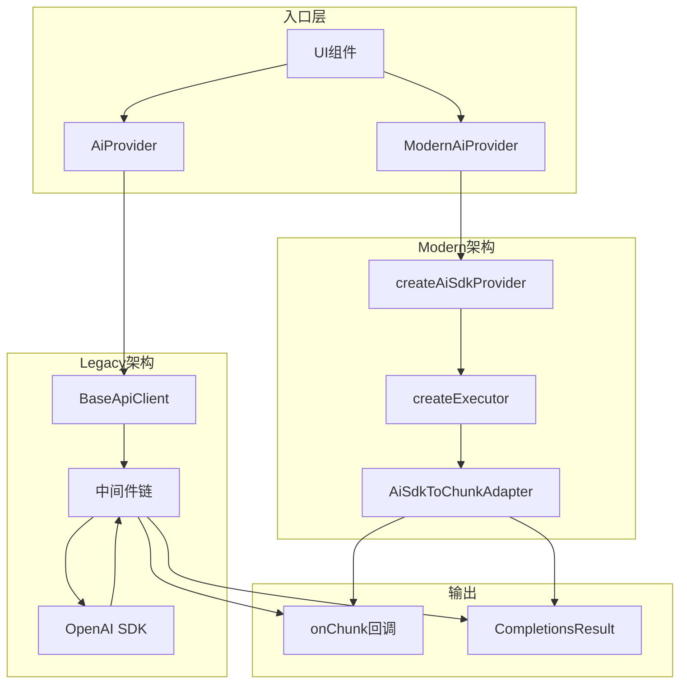
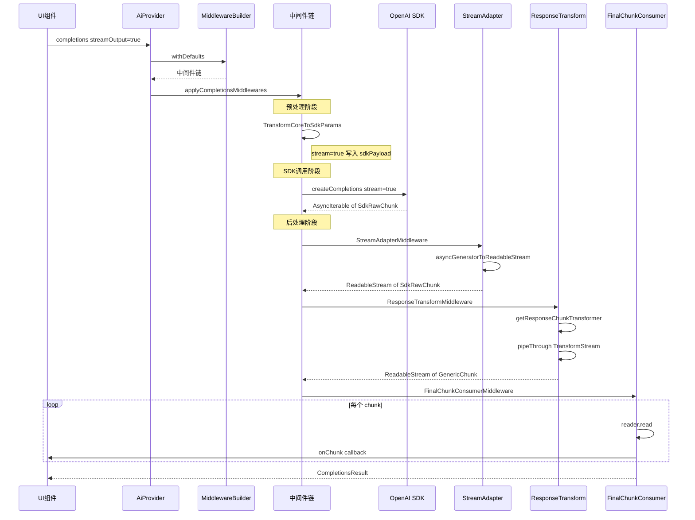
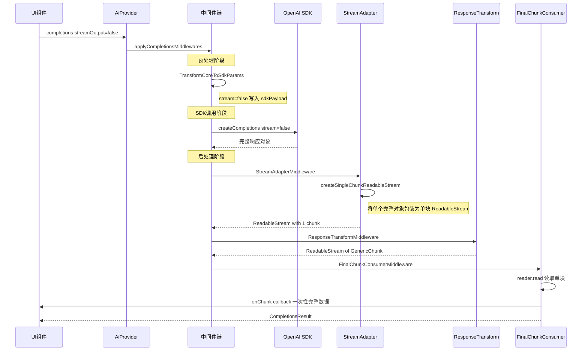

# Cherry Studio 流式与非流式输出请求完整链路分析

## 1. 概述

Cherry Studio 的 `aiCore` 层采用了**双架构设计**：
- **Legacy 架构**: 基于 Redux 风格中间件的传统实现
- **Modern 架构**: 基于 AI SDK 的新实现

两套架构都支持流式和非流式输出，但处理机制有显著差异。

---

## 2. 架构总览



---

## 3. Legacy 架构详解

### 3.1 核心文件结构

```
aiCore/legacy/
├── index.ts                    # AiProvider 入口类
├── clients/
│   ├── BaseApiClient.ts        # API客户端基类
│   ├── ApiClientFactory.ts     # 客户端工厂
│   ├── openai/
│   │   └── OpenAIApiClient.ts  # OpenAI 客户端实现
│   └── types.ts                # 类型定义
└── middleware/
    ├── builder.ts              # 中间件构建器
    ├── composer.ts             # 中间件组合器
    ├── register.ts             # 中间件注册表
    ├── schemas.ts              # 请求/响应模式
    ├── types.ts                # 类型定义
    ├── common/
    │   ├── FinalChunkConsumerMiddleware.ts
    │   ├── ErrorHandlerMiddleware.ts
    │   └── AbortHandlerMiddleware.ts
    └── core/
        ├── StreamAdapterMiddleware.ts
        ├── ResponseTransformMiddleware.ts
        └── TransformCoreToSdkParamsMiddleware.ts
```

### 3.2 请求参数定义

关键参数在 [`schemas.ts`](docs/参考项目/cherry-studio-main/src/renderer/src/aiCore/legacy/middleware/schemas.ts) 中定义：

```typescript
export interface CompletionsParams {
  // 关键：控制流式/非流式输出
  streamOutput: boolean
  
  // 业务场景类型
  callType?: 'chat' | 'translate' | 'summary' | ...
  
  // 消息数据
  messages: Message[] | string
  assistant: Assistant
  
  // 流式回调
  onChunk?: (chunk: Chunk) => void
  onResponse?: (text: string, isComplete: boolean) => void
  
  // 其他参数...
  mcpTools?: MCPTool[]
  enableWebSearch?: boolean
}
```

### 3.3 默认中间件链

在 [`register.ts`](docs/参考项目/cherry-studio-main/src/renderer/src/aiCore/legacy/middleware/register.ts:110) 中定义：

```typescript
export const DefaultCompletionsNamedMiddlewares = [
  FinalChunkConsumerMiddleware,      // 1. 最终消费者
  ErrorHandlerMiddleware,            // 2. 错误处理
  TransformCoreToSdkParamsMiddleware,// 3. 参数转换
  AbortHandlerMiddleware,            // 4. 中止处理
  McpToolChunkMiddleware,            // 5. MCP工具处理
  TextChunkMiddleware,               // 6. 文本处理
  WebSearchMiddleware,               // 7. Web搜索处理
  ToolUseExtractionMiddleware,       // 8. 工具使用提取
  ThinkingTagExtractionMiddleware,   // 9. 思考标签提取
  ThinkChunkMiddleware,              // 10. 思考处理
  ResponseTransformMiddleware,       // 11. 响应转换
  StreamAdapterMiddleware,           // 12. 流适配器
  RawStreamListenerMiddleware        // 13. 原始流监听
]
```

---

## 4. 流式输出完整链路

### 4.1 Legacy 架构流式输出



### 4.2 关键代码分析

#### 4.2.1 SDK调用 - [`OpenAIApiClient.createCompletions()`](docs/参考项目/cherry-studio-main/src/renderer/src/aiCore/legacy/clients/openai/OpenAIApiClient.ts:112)

```typescript
override async createCompletions(
  payload: OpenAISdkParams,
  options?: OpenAI.RequestOptions
): Promise<OpenAISdkRawOutput> {
  const sdk = await this.getSdkInstance()
  // payload.stream 决定返回 AsyncIterable 还是完整对象
  return await sdk.chat.completions.create(payload, options)
}
```

#### 4.2.2 流适配 - [`StreamAdapterMiddleware`](docs/参考项目/cherry-studio-main/src/renderer/src/aiCore/legacy/middleware/core/StreamAdapterMiddleware.ts:20)

```typescript
export const StreamAdapterMiddleware: CompletionsMiddleware =
  () => (next) => async (ctx, params) => {
    const result = await next(ctx, params)
    
    // 流式输出：AsyncIterable 转换为 ReadableStream
    if (isAsyncIterable<SdkRawChunk>(result.rawOutput)) {
      const whatwgReadableStream = asyncGeneratorToReadableStream<SdkRawChunk>(
        result.rawOutput
      )
      return { ...result, stream: whatwgReadableStream }
    }
    
    // 非流式输出：包装为单块流
    else if (result.rawOutput) {
      const whatwgReadableStream = createSingleChunkReadableStream<SdkRawChunk>(
        result.rawOutput as SdkRawChunk
      )
      return { ...result, stream: whatwgReadableStream }
    }
    
    return result
  }
```

#### 4.2.3 响应转换 - [`ResponseTransformMiddleware`](docs/参考项目/cherry-studio-main/src/renderer/src/aiCore/legacy/middleware/core/ResponseTransformMiddleware.ts:22)

```typescript
export const ResponseTransformMiddleware: CompletionsMiddleware =
  () => (next) => async (ctx, params) => {
    const result = await next(ctx, params)
    
    if (result.stream instanceof ReadableStream) {
      // 获取客户端的响应转换器
      const responseChunkTransformer = apiClient.getResponseChunkTransformer(ctx)
      
      // 使用 TransformStream 将原始 SDK chunk 转换为 GenericChunk
      const genericChunkTransformStream = adaptedStream.pipeThrough<GenericChunk>(
        new TransformStream<SdkRawChunk, GenericChunk>(
          responseChunkTransformer(transformerContext)
        )
      )
      
      return { ...result, stream: genericChunkTransformStream }
    }
    
    return result
  }
```

#### 4.2.4 最终消费 - [`FinalChunkConsumerMiddleware`](docs/参考项目/cherry-studio-main/src/renderer/src/aiCore/legacy/middleware/common/FinalChunkConsumerMiddleware.ts:22)

```typescript
const FinalChunkConsumerMiddleware: CompletionsMiddleware =
  () => (next) => async (ctx, params) => {
    const result = await next(ctx, params)
    
    if (result.stream instanceof ReadableStream) {
      const reader = result.stream.getReader()
      
      try {
        while (true) {
          const { done, value: chunk } = await reader.read()
          if (done) break
          
          // 累加 usage/metrics 数据
          extractAndAccumulateUsageMetrics(ctx, chunk)
          
          // 调用 onChunk 回调通知 UI
          params.onChunk?.(chunk)
        }
      } finally {
        // 发送 BLOCK_COMPLETE 信号
        params.onChunk?.({
          type: ChunkType.BLOCK_COMPLETE,
          response: {
            usage: ctx._internal.observer?.usage,
            metrics: ctx._internal.observer?.metrics
          }
        })
      }
    }
    
    return result
  }
```

---

## 5. 非流式输出完整链路

### 5.1 Legacy 架构非流式输出



### 5.2 关键区别

#### 5.2.1 参数传递

在 [`TransformCoreToSdkParamsMiddleware`](docs/参考项目/cherry-studio-main/src/renderer/src/aiCore/legacy/middleware/core/TransformCoreToSdkParamsMiddleware.ts) 中：

```typescript
// 流式参数设置
const commonParams: OpenAISdkParams = {
  model: model.id,
  messages: reqMessages,
  stream: streamOutput,  // <-- 关键参数
  ...(shouldIncludeStreamOptions ? { stream_options: { include_usage: true } } : {}),
  // ...
}
```

#### 5.2.2 响应转换器处理

在 [`OpenAIApiClient.getResponseChunkTransformer()`](docs/参考项目/cherry-studio-main/src/renderer/src/aiCore/legacy/clients/openai/OpenAIApiClient.ts:762) 中：

```typescript
getResponseChunkTransformer(): ResponseChunkTransformer<OpenAISdkRawChunk> {
  return (context) => ({
    async transform(chunk, controller) {
      // 处理 choices 数组
      if ('choices' in chunk && chunk.choices?.length > 0) {
        for (const choice of chunk.choices) {
          // 流式响应使用 delta，非流式响应使用 message
          let contentSource = null
          if ('delta' in choice && choice.delta && Object.keys(choice.delta).length > 0) {
            contentSource = choice.delta  // 流式：增量数据
          } else if ('message' in choice) {
            contentSource = choice.message  // 非流式：完整数据
          }
          
          // 转换为 GenericChunk...
        }
      }
    },
    
    flush(controller) {
      // 流结束时的清理逻辑
    }
  })
}
```

---

## 6. Modern 架构详解

### 6.1 Modern 架构流式输出

在 [`index_new.ts`](docs/参考项目/cherry-studio-main/src/renderer/src/aiCore/index_new.ts:271) 中：

```typescript
private async modernCompletions(
  model: LanguageModel,
  params: StreamTextParams,
  config: ModernAiProviderConfig
): Promise<CompletionsResult> {
  const executor = createExecutor(this.config!.providerId, this.config!.options, plugins)
  
  if (config.onChunk) {
    const adapter = new AiSdkToChunkAdapter(
      config.onChunk,
      config.mcpTools,
      accumulate,
      config.enableWebSearch
    )
    
    // 流式执行
    const streamResult = await executor.streamText({
      ...params,
      model,
      experimental_context: { onChunk: config.onChunk }
    })
    
    // 通过适配器处理流
    const finalText = await adapter.processStream(streamResult)
    
    return { getText: () => finalText }
  } else {
    // 非流式：强制消费流
    const streamResult = await executor.streamText({ ...params, model })
    await streamResult?.consumeStream()
    const finalText = await streamResult.text
    
    return { getText: () => finalText }
  }
}
```

### 6.2 AiSdkToChunkAdapter

在 [`AiSdkToChunkAdapter.ts`](docs/参考项目/cherry-studio-main/src/renderer/src/aiCore/chunk/AiSdkToChunkAdapter.ts:67) 中：

```typescript
async processStream(aiSdkResult: any): Promise<string> {
  if (aiSdkResult.fullStream) {
    await this.readFullStream(aiSdkResult.fullStream)
  }
  return await aiSdkResult.text
}

private async readFullStream(fullStream: ReadableStream<TextStreamPart<ToolSet>>) {
  const reader = fullStream.getReader()
  
  while (true) {
    const { done, value } = await reader.read()
    if (done) break
    
    // 转换 AI SDK chunk 为 Cherry Studio chunk
    this.convertAndEmitChunk(value, final)
  }
}

private convertAndEmitChunk(chunk: TextStreamPart<any>, final) {
  switch (chunk.type) {
    case 'text-delta':
      this.onChunk({ type: ChunkType.TEXT_DELTA, text: chunk.text })
      break
    case 'reasoning-delta':
      this.onChunk({ type: ChunkType.THINKING_DELTA, text: final.reasoningContent })
      break
    case 'finish':
      this.onChunk({ type: ChunkType.BLOCK_COMPLETE, response: {...} })
      this.onChunk({ type: ChunkType.LLM_RESPONSE_COMPLETE, response: {...} })
      break
    // ... 其他类型
  }
}
```

---

## 7. Chunk 类型体系

在 [`chunk.ts`](docs/参考项目/cherry-studio-main/src/renderer/src/types/chunk.ts) 中定义了完整的 Chunk 类型：

```typescript
export enum ChunkType {
  // 块生命周期
  BLOCK_CREATED = 'block_created',
  BLOCK_IN_PROGRESS = 'block_in_progress',
  BLOCK_COMPLETE = 'block_complete',
  
  // LLM响应生命周期
  LLM_RESPONSE_CREATED = 'llm_response_created',
  LLM_RESPONSE_IN_PROGRESS = 'llm_response_in_progress',
  LLM_RESPONSE_COMPLETE = 'llm_response_complete',
  
  // 文本内容
  TEXT_START = 'text.start',
  TEXT_DELTA = 'text.delta',
  TEXT_COMPLETE = 'text.complete',
  
  // 思考内容
  THINKING_START = 'thinking.start',
  THINKING_DELTA = 'thinking.delta',
  THINKING_COMPLETE = 'thinking.complete',
  
  // 工具调用
  MCP_TOOL_CREATED = 'mcp_tool_created',
  MCP_TOOL_PENDING = 'mcp_tool_pending',
  MCP_TOOL_IN_PROGRESS = 'mcp_tool_in_progress',
  MCP_TOOL_COMPLETE = 'mcp_tool_complete',
  
  // 搜索相关
  WEB_SEARCH_IN_PROGRESS = 'web_search_in_progress',
  WEB_SEARCH_COMPLETE = 'web_search_complete',
  LLM_WEB_SEARCH_IN_PROGRESS = 'llm_websearch_in_progress',
  LLM_WEB_SEARCH_COMPLETE = 'llm_websearch_complete',
  
  // 图片
  IMAGE_CREATED = 'image.created',
  IMAGE_DELTA = 'image.delta',
  IMAGE_COMPLETE = 'image.complete',
  
  // 错误
  ERROR = 'error',
}
```

---

## 8. 流式 vs 非流式对比总结

| 维度 | 流式输出 | 非流式输出 |
|------|----------|------------|
| **SDK参数** | `stream: true` | `stream: false` |
| **SDK返回值** | `AsyncIterable<ChatCompletionChunk>` | `ChatCompletion` 完整对象 |
| **StreamAdapter处理** | `asyncGeneratorToReadableStream()` | `createSingleChunkReadableStream()` |
| **数据传输** | 逐块增量传输 | 一次性完整传输 |
| **用户体验** | 实时显示，响应快 | 等待完整响应后显示 |
| **Chunk回调次数** | 多次，每块调用一次 | 单次，完整数据 |
| **内存占用** | 低，逐块处理 | 高，需缓存完整响应 |
| **适用场景** | 聊天对话、实时交互 | 短文本生成、API测试 |

---

## 9. 数据流转换图

```mermaid
graph LR
    subgraph SDK层
        A1[OpenAI SDK Request]
        A2[stream: true/false]
    end
    
    subgraph SDK响应
        B1[AsyncIterable - 流式]
        B2[ChatCompletion - 非流式]
    end
    
    subgraph StreamAdapter
        C1[asyncGeneratorToReadableStream]
        C2[createSingleChunkReadableStream]
        C3[ReadableStream of SdkRawChunk]
    end
    
    subgraph ResponseTransform
        D1[getResponseChunkTransformer]
        D2[TransformStream]
        D3[ReadableStream of GenericChunk]
    end
    
    subgraph FinalConsumer
        E1[reader.read loop]
        E2[onChunk callback]
        E3[CompletionsResult]
    end
    
    A1 --> A2
    A2 -->|stream=true| B1
    A2 -->|stream=false| B2
    
    B1 --> C1
    B2 --> C2
    C1 --> C3
    C2 --> C3
    
    C3 --> D1
    D1 --> D2
    D2 --> D3
    
    D3 --> E1
    E1 --> E2
    E1 --> E3
```



---

## 10. 关键设计模式

### 10.1 中间件模式

Cherry Studio 采用类似 Redux 的中间件模式，在 [`composer.ts`](docs/参考项目/cherry-studio-main/src/renderer/src/aiCore/legacy/middleware/composer.ts:57) 中实现：

```typescript
function compose(...funcs) {
  if (funcs.length === 0) return (...args) => args[0]
  if (funcs.length === 1) return funcs[0]
  return funcs.reduce((a, b) => (...args) => a(b(...args)))
}
```

中间件签名：
```typescript
type CompletionsMiddleware = (api) => (next) => (context, params) => Promise<CompletionsResult>
```

### 10.2 TransformStream 模式

使用 Web Streams API 的 TransformStream 进行数据转换，实现流式处理的管道化。

### 10.3 适配器模式

`AiSdkToChunkAdapter` 将 AI SDK 的流格式适配为 Cherry Studio 的 Chunk 格式。

---

## 11. 总结

Cherry Studio 的流式/非流式输出设计具有以下特点：

1. **统一的流处理**: 无论流式还是非流式，最终都转换为 ReadableStream 进行统一处理
2. **可插拔的中间件**: 通过 MiddlewareBuilder 灵活配置处理链
3. **类型安全的 Chunk**: 完善的 Chunk 类型定义确保类型安全
4. **双架构兼容**: Legacy 和 Modern 架构并存，便于渐进式迁移
5. **响应式设计**: 通过 onChunk 回调实现实时 UI 更新

这种设计使得系统能够灵活处理各种 AI Provider 的响应，同时保持代码的可维护性和可扩展性。