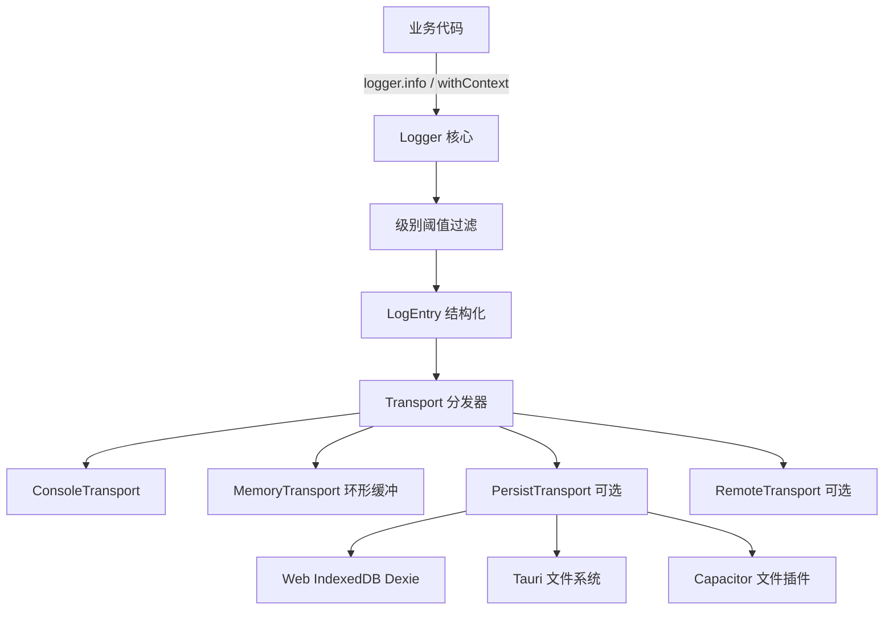
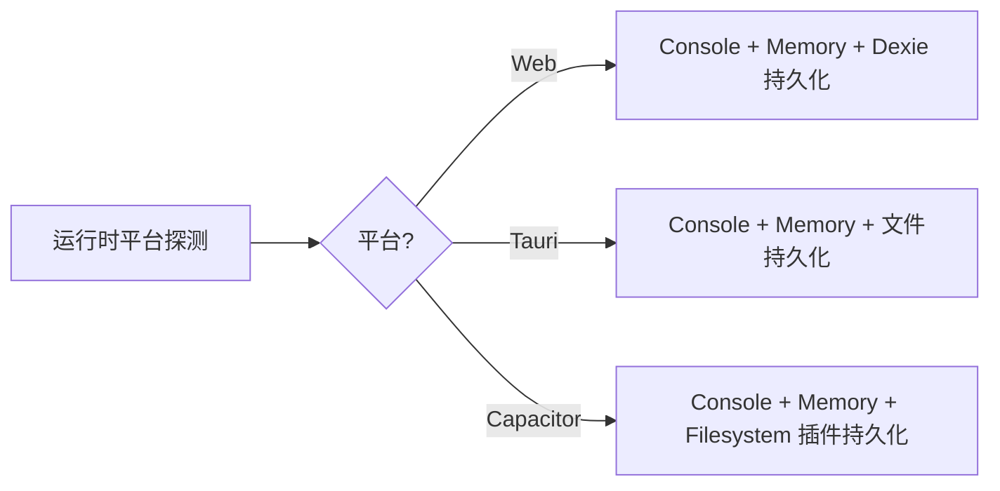
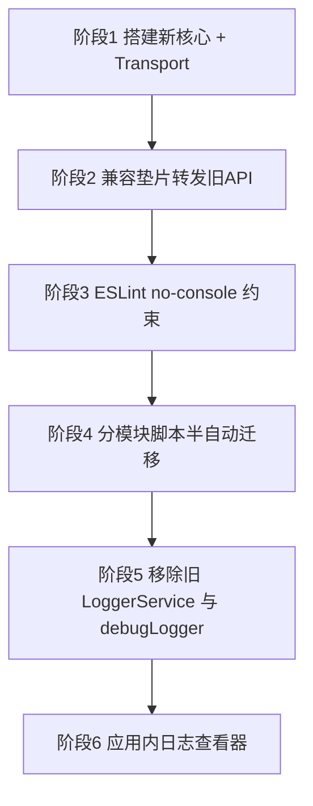

# AetherLink 全新统一日志系统 — 架构设计方案

> 状态：设计稿（待评审）
> 适用范围：Web / Tauri 桌面端 / Capacitor 移动端（Android、iOS、HarmonyOS）
> 目标：用一套统一、可分级、可扩展、生产零开销的日志系统，替换当前碎片化的日志现状。

---

## 1. 背景与现状

### 1.1 现状盘点（实测数据）

| 日志方式 | 数量 | 占比 | 说明 |
|---------|------|------|------|
| 裸 `console.*`（log/error/warn/info/debug） | 约 3040 处 | 约 99% | 散落全线，无分级、无开关、生产照样打印 |
| `LoggerService`（`infra/LoggerService.ts`） | 约 30 处（19 个文件导入） | 小于 1% | 仅网络层/API 层使用 |
| `debugLog`（`utils/debugLogger.ts`） | 10 处 | 小于 1% | 几乎无人使用，且用 `process.env.NODE_ENV` 判断环境（浏览器不可靠） |

### 1.1.1 已有的采集 / 查看基础设施（易被忽略，但必须纳入）

除了上面三种「写日志」的方式，项目里其实已经有一套「采集 + 查看」设施，设计时**不能当作不存在**：

| 模块 | 能力 | 现状 |
|------|------|------|
| `EnhancedConsoleService`（`infra/EnhancedConsoleService.ts`） | 启动即全局拦截所有 `console.*`、捕获 `window error` / `unhandledrejection`、1000 条环形缓冲、监听器 + 过滤/搜索、噪音 error 过滤 | 在 `initializeServices` 中**无条件初始化（生产也常驻）** |
| `EnhancedNetworkService` + `DevTools/NetworkPanel` | 网络请求拦截与查看 | 已上线 |
| `DevToolsPage`（`/devtools` 路由）+ `ConsolePanel` | 应用内控制台/日志查看器 | 已上线 |

> 也就是说，本方案里当作「待新建」的 **内存环形缓冲、全局错误采集、应用内日志查看器（阶段6）**，其实大部分已经存在。新系统应当**复用/对接**它们，而不是重复造轮子。

### 1.2 核心问题

1. **多套体系并存且互不相干**（裸 console / LoggerService / debugLog，且与上方 `EnhancedConsoleService` 采集层割裂），没有统一入口。
2. **设计较好的 `LoggerService` 未被推广**，覆盖率不足 1%。
3. **99% 是裸 console**，导致：
   - 生产构建全量输出，泄露信息、拖慢性能；
   - 前缀 `[模块名]` 全靠手写约定，风格不统一；
   - 无法集中控制级别、开关、过滤、采集上报；
   - 移动端/桌面端线上问题难以排查（日志拿不到）。

### 1.3 现有 `LoggerService` 可复用的优点

- 已有 `LogLevel` 类型（DEBUG/INFO/WARN/ERROR）——注意：**当前 `log()` 并未做阈值过滤，任何级别都照打照存**，所谓「分级」只有类型没有控制；
- 已有内存缓存 + 防抖持久化到 Dexie（保留最近 100 条）；
- 已有 `getRecentLogs` / `clearLogs` 查询接口；
- 已有 `logApiRequest` / `logApiResponse` 专用方法。
- 此外 `EnhancedConsoleService` 的环形缓冲 + 全局错误捕获、`DevToolsPage`/`ConsolePanel` 的查看器，都可直接复用为新系统的 Memory 通道与查看 UI。

> 新系统将继承这些优点，并扩展为多端、多 Transport、命名空间化的完整体系。

---

## 2. 设计目标

| 目标 | 描述 |
|------|------|
| 统一入口 | 全项目唯一 `logger`，废弃裸 console 与旧两套工具 |
| 分级可控 | 运行时可调级别阈值，按环境/模块差异化 |
| 命名空间 | `logger.withContext('MCP')` 自动前缀，告别手写 `[xxx]` |
| 多端适配 | Web / Tauri / Capacitor 自动选择合适的输出与持久化通道 |
| 可扩展 Transport | 控制台、内存环形缓冲、持久化、远程上报互相解耦 |
| 生产零开销 | 生产剥离 DEBUG/TRACE，或级别阈值短路，性能无损 |
| 平滑迁移 | 兼容垫片转发旧 API，避免一次性改 3000 处 |
| 可排查 | 日志可在应用内查看、导出、按级别/模块过滤 |

---

## 3. 整体架构

### 3.1 分层结构



### 3.2 目录结构（建议）

```
src/shared/services/infra/logger/
├── index.ts              # 统一出口：export const logger, createLogger, 类型
├── Logger.ts             # 核心类：分级、命名空间、上下文、分发
├── types.ts              # LogLevel / LogEntry / Transport / LoggerConfig 接口
├── config.ts             # 默认级别阈值、环境判断、运行时开关读写
├── transports/
│   ├── ConsoleTransport.ts   # 彩色/前缀的控制台输出
│   ├── MemoryTransport.ts    # 环形缓冲（替代当前固定 100 条）
│   ├── PersistTransport.ts   # 持久化（按平台选 Dexie/文件）
│   └── RemoteTransport.ts    # 可选：远程上报（预留）
└── compat.ts             # 兼容垫片：转发旧 LoggerService / debugLog 签名
```

### 3.3 与现有 DevTools / EnhancedConsoleService 的整合（不要重复造轮子）

这是本次新增的关键决策。`EnhancedConsoleService` 的原理是「**拦截 console**」，而新系统的目标是「**统一走 logger、收敛 console**」，两者若不协调会冲突：

- 若生产构建 `drop` 掉 `console.debug/trace` → DevTools 控制台**丢数据**；
- 若 `ConsoleTransport` 仍调 `console.*` → 每条日志被 `EnhancedConsoleService` **二次捕获**，两个环形缓冲（新 500 + 旧 1000）内存浪费、格式不一致。

**决策（二选一，推荐 A）**：

- **A. logger 作为唯一结构化数据源**：`MemoryTransport` 复用/取代 `EnhancedConsoleService` 的环形缓冲；`DevTools/ConsolePanel` 改为从 `MemoryTransport` 读取；保留全局 `error`/`unhandledrejection` 捕获和噪音 error 过滤逻辑（迁移进新系统，不能丢）。`EnhancedConsoleService` 的 console 拦截**逐步退役**。
- **B. 暂不动 `EnhancedConsoleService`**：`ConsoleTransport` 照常输出，由它继续兜底捕获；新系统先不引入独立 MemoryTransport，避免双缓冲。迁移完成后再切到 A。

> 无论选哪种，都**不要新建一个和 `DevToolsPage` 平行的日志查看器**。

---

## 4. 核心 API 设计

### 4.1 日志级别

```
SILENT = 0   // 关闭所有
ERROR  = 1
WARN   = 2
INFO   = 3
DEBUG  = 4
TRACE  = 5   // 最详细
```

- 仅当 `entry.level <= currentThreshold` 时才输出（数值越小越重要）。
- 默认阈值：开发环境 `DEBUG`，生产环境 `WARN`。

### 4.2 主要接口（伪代码，仅描述形态）

```ts
// 全局单例
logger.error(message, ...args)
logger.warn(message, ...args)
logger.info(message, ...args)
logger.debug(message, ...args)
logger.trace(message, ...args)

// 命名空间工厂（推荐业务使用）
const log = logger.withContext('MCP')
log.info('调用工具', { tool, args })   // 输出 [MCP] 调用工具 ...

// 运行时控制
logger.setLevel('DEBUG')
logger.getLevel()

// 查询与导出（应用内日志查看器使用）
logger.getRecentLogs(count?)
logger.exportLogs(format)   // json / text
logger.clearLogs()

// 专用方法（继承现有能力）
logger.logApiRequest(endpoint, level, data)
logger.logApiResponse(endpoint, statusCode, data)
```

### 4.3 LogEntry 结构

```ts
interface LogEntry {
  timestamp: number      // epoch ms
  level: LogLevel
  context?: string       // 命名空间，如 'MCP'
  message: string
  args?: unknown[]        // 附加数据
  platform: 'web' | 'tauri' | 'capacitor'
}
```

---

## 5. Transport 设计

| Transport | 职责 | 默认启用 | 备注 |
|-----------|------|---------|------|
| ConsoleTransport | 输出到浏览器/原生控制台，带颜色与前缀 | 是 | 生产可按级别裁剪 |
| MemoryTransport | 环形缓冲（如最近 500 条），供应用内查看器 | 是 | 替代当前固定 100 条 Dexie 缓存 |
| PersistTransport | 持久化到磁盘/IndexedDB，供导出与崩溃排查 | 可选 | 平台适配见 6 |
| RemoteTransport | 上报到远端（如 Sentry/自建） | 否（预留） | 需用户授权 |

- 每个 Transport 实现统一接口 `write(entry: LogEntry): void | Promise<void>`。
- Transport 各自维护级别阈值（如 Console 输 DEBUG，Persist 仅存 INFO 以上）。

---

## 6. 多端适配策略



| 平台 | 控制台 | 持久化方案 | 导出方式 |
|------|--------|-----------|---------|
| Web | DevTools Console | IndexedDB（复用 Dexie） | 浏览器下载 |
| Tauri 桌面 | WebView Console + 可选 Rust 端 | 文件系统（app log 目录） | 打开日志文件/目录 |
| Capacitor 移动 | Logcat/Xcode Console | Filesystem 插件写文件 | 分享/导出文件 |

> 平台探测复用现有 `isTauri()` 与 `Capacitor.isNativePlatform()` 工具。

---

## 7. 生产环境零开销

两种手段叠加：

1. **运行期短路（首选）**：级别阈值在最外层判断，未达阈值直接 return，不做字符串拼接与序列化。环境判定统一用 `import.meta.env.DEV` / `__DEV__`（已在 vite.config define），**不要用 `process.env.NODE_ENV`**。
2. **惰性求值**：对开销大的日志提供 `logger.debug(() => buildMsg())` 形态，未达阈值时连实参都不计算（普通函数调用的实参仍会 eager 求值，这点务必说明）。
3. **构建期剥离（可选/进阶）**：本仓库是 Vite 8 / Rolldown，esbuild 的 `drop` 只能删 `console.*`，**删不掉自定义 `logger.debug()`**，且 Rolldown 行为可能不同。建议待验证后再启用，首期只靠运行期短路 + 惰性求值。

---

## 8. 迁移策略（分阶段）



### 阶段说明

1. **阶段1 — 搭建新核心**：实现 `logger/` 目录全部模块，独立可用，不影响现有代码。
2. **阶段2 — 兼容垫片**：`compat.ts` 让旧 `LoggerService.log()` 与 `debugLog.*` 转发到新系统；19 个旧文件无需立即改动。
3. **阶段3 — ESLint 约束**：开启 `no-console`（允许 `error`/`warn` 或完全禁止），新代码强制走 `logger`。
4. **阶段4 — 分模块迁移**：把 `console.xxx('[Mod] ...')` 替换为 `createLogger('Mod').xxx(...)`，逐模块验证。**实际执行采用手动分子系统迁移、每子系统一个小 PR，不做全仓盲目 codemod**（级别语义与命名空间需人判断，多行/多参调用易被正则改坏）——统一规则与进度见 §13。
5. **阶段5 — 清理**：迁移完成后删除旧 `LoggerService.ts`、`debugLogger.ts`，移除垫片。
6. **阶段6 — 日志查看器**：**复用现有 `DevToolsPage`/`ConsolePanel`**（见 3.3），改为从 `MemoryTransport` 读取并增加按模块/级别过滤与导出，不另起炉灶。

### 迁移优先级建议

- 高优先：`shared/services/*`、`shared/store/*`、`shared/api/*`（核心链路，日志量大）。
- 中优先：`shared/utils/*`、`hooks/*`。
- 低优先：`components/*`、`pages/*`（UI 层，日志相对次要）。

---

## 9. 风险与对策

| 风险 | 对策 |
|------|------|
| 3000 处迁移工作量大 | codemod 脚本半自动 + 分模块分批，垫片兜底不阻塞 |
| 构建期剥离误删 | 优先用运行期短路，剥离作为可选项并充分测试 |
| 移动端文件写入权限/性能 | PersistTransport 异步 + 节流；权限失败降级为仅内存 |
| 循环依赖（logger 依赖 storage，storage 又打日志） | logger 核心零业务依赖；持久化通过延迟注入/事件解耦 |
| 日志包含敏感信息（API Key 等） | 增加脱敏钩子，序列化前过滤敏感字段 |

---

## 10. 待决策项（评审时确认）

1. 是否需要 **持久化到文件**（Tauri/移动端线上排查）？还是内存缓冲即可？
2. 是否需要 **远程上报**（RemoteTransport）？若需要，目标服务（Sentry/自建）？
3. ESLint `no-console` 力度：**完全禁止** 还是 **保留 error/warn**？
4. 是否需要 **应用内日志查看器**（阶段6）？
5. 生产环境是否启用 **构建期剥离**，还是只用运行期级别短路？
6. 命名空间风格：`createLogger('MCP')` 还是 `logger.withContext('MCP')`，或两者都提供？

---

## 11. 下一步

评审通过后，切换到 Code 模式按阶段实施。建议首批交付：阶段 1（核心）+ 阶段 2（垫片）+ 阶段 3（ESLint），即可让新代码立即受益且不破坏现状。

---

## 12. 务实增强与边界（够用即可，不过度工程）

本项目是开源**客户端**应用，不需要自建可观测性后端管线。在上面统一 logger 的基础上，只挑性价比最高的几项「企业级」做法，其余明确不做。

### 12.1 值得做（轻量、收益高）

1. **结构化事件**：`LogEntry` 用 `{ message, args, context }` 分离，而不是把变量拼进字符串——后续检索/过滤/上报都依赖它。
2. **脱敏作为核心步骤**：在 Transport 写出前统一过滤 API Key / token / 敏感字段（本项目大量 `logApiRequest/Response` 会打这些），不要只当「风险对策」。
3. **可选的远程上报（opt-in）**：仅在用户**主动同意 / 点击「导出并上报日志」**时，把内存/持久化日志打包上传（或接入 Sentry 这类现成错误监控）。默认关闭，复用已有的全局错误捕获对接即可。
4. **基础关联字段**：`context` 里带上 `platform / release(版本) / sessionId`，线上排障定位用，成本极低。

### 12.2 明确不做（避免过度工程）

- ❌ 不自建日志采集网关 / 存储 / 看板（OTel Collector、Loki、ELK 等）——客户端项目用不上。
- ❌ 不默认开启任何自动远程上报（隐私 + 成本）。
- ❌ 不引入完整分布式 tracing（traceId 串前后端）——除非将来有自有后端服务再说。
- ❌ 不做 Metrics / 告警 / 采样限流这套后端可观测性。
- ❌ 不为「企业级」而强行加抽象层；Transport 接口保持最小（一个 `write(entry)` 足够）。

> 一句话：**统一入口 + 分级短路 + 结构化 + 脱敏 + 复用 DevTools 查看器**，就是本项目「够用的企业级」。远程上报/Sentry 作为 opt-in 可选项，其余一律不做。

---

## 13. 实施进度与迁移规范（执行记录）

> 本节随实施滚动更新，记录已落地的 PR 与统一迁移规范（供后续分模块迁移 / 子代理照做）。

### 13.1 已落地

| 阶段 | 内容 | PR | 状态 |
|------|------|----|------|
| 1+2+3 | logger 核心 + 兼容垫片 + ESLint `no-console` | #240 | 已合并 |
| 4 样板A | `src/shared/services/mcp`（222 处 / 15 文件） | #241 | 已合并 |
| 4 样板B | `src/shared/store`（155 处 / 22 文件） | #242 | 已合并 |

新 logger 位于 `src/shared/services/infra/logger/`，对外导出 `logger`、`createLogger(context)`、`Logger`、Transport 与类型。

### 13.2 迁移规范（统一规则，分模块迁移一律照此执行）

1. **建 logger**：每个文件在所有 `import` 之后新增一个模块级 logger：
   ```ts
   import { createLogger } from '../../services/infra/logger'; // 相对深度按文件实际层级
   const logger = createLogger('<Context>');
   ```
   `<Context>` 取自该文件原有 `[前缀]` 标签（去掉方括号）；无前缀的文件取其主模块名（文件名/类名/函数名）。
2. **相对路径**：仓库 `tsconfig` 无 `@/` 路径别名（`@` 仅在 Vite 构建生效），故 logger 导入**一律用相对路径**，按文件层级写 `../`。
3. **级别映射**：`console.log` → `logger.debug`（绝大多数诊断/冗余日志，生产默认隐藏）；仅**真正有意义的运营里程碑**才升级为 `logger.info`。`console.info`→`info`、`console.debug`→`debug`、`console.warn`→`warn`、`console.error`→`error`；`console.group/groupEnd` 折叠为一条 `debug`。
4. **剥前缀保参数**：去掉消息字符串里的 `[前缀]`（命名空间已携带），其余参数、顺序、emoji、错误对象尾参全部保留。
   ```diff
   - console.log('[MCP] 复用现有连接:', server.name)
   + logger.debug('复用现有连接:', server.name)   // createLogger('MCP')
   ```
5. **混合前缀文件**：取主模块作模块级 logger，其余少数前缀用 `logger.withContext('Other')` 派生子 logger（注意 `withContext` 是**替换** context，不是层级拼接）。
6. **只改日志出口**：不改任何业务行为；不改 logger 核心 / 旧 `LoggerService` / ESLint 配置。
7. **验收**：目标目录内 `console.*` 归零（`warn`/`error` 虽被 ESLint 放行，但建议一并迁以保持一致）；`npm run type-check` 与 `npm run build`（`vite build`）**必须通过**（CI 门禁）。
8. **方式**：手动分子系统、每子系统一个小 PR；**不做全仓盲目 codemod**。仅当某子系统「特别简单」（单行调用、统一带 `[前缀]`、无多行/多参歧义）时，允许用「按文件配置 + 全量 diff 复核 + 编译」的受控脚本辅助。

### 13.3 剩余盘点（`console.*` 总量 / 必迁 `log·info·debug·group` / 文件数）

| 子系统 | 总数 | 必迁 | 文件 | 状态 |
|--------|------|------|------|------|
| `shared/services/mcp` | 222 | — | 15 | ✅ #241 |
| `shared/store` | 155 | — | 22 | ✅ #242 |
| `shared/api` | 264 | 176 | 30 | 进行中 |
| `shared/services`（非 mcp） | 1232 | 623 | 105 | 待迁（含 storage 183 / messages 169 / ai 138 / webSearch 120 / files 106 / knowledge 105 …） |
| `shared/utils` | 207 | 107 | 33 | 待迁 |
| `shared/hooks` | 40 | 21 | 9 | 待迁 |
| `shared/providers` | 23 | 11 | 2 | 待迁 |
| `components` | 326 | 116 | 101 | 待迁（多为 error/warn） |
| `pages` | 418 | 162 | 67 | 待迁（多为 error/warn） |
| `hooks`（顶层） | 49 | 27 | 8 | 待迁 |
| `utils`（顶层） | 61 | 21 | 5 | 待迁 |

> 注：`ConsoleTransport` / `EnhancedConsoleService` / `LoggerService` 等日志后端自身的 `console` 使用（约 16 处）为有意保留，已在 ESLint 中豁免，不计入迁移目标。

### 13.4 已确定的决策（对应 §10）

- ESLint `no-console` 力度：**保留 `error`/`warn`**，其余告警（不一次性禁止，避免 CI 爆 3000+ 错）。
- 命名空间风格：**两者都提供** —— 文件级默认 `createLogger('Mod')`，文件内细分用 `logger.withContext('Sub')`。
