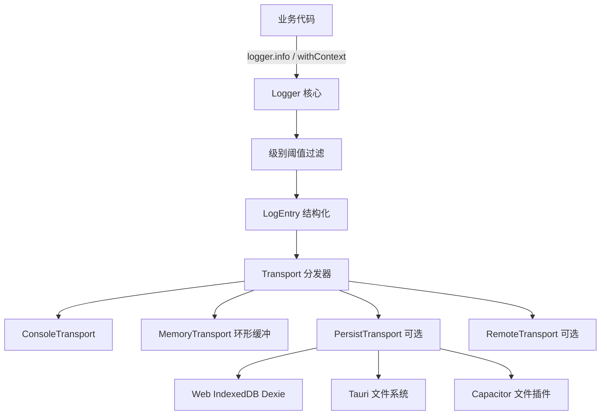
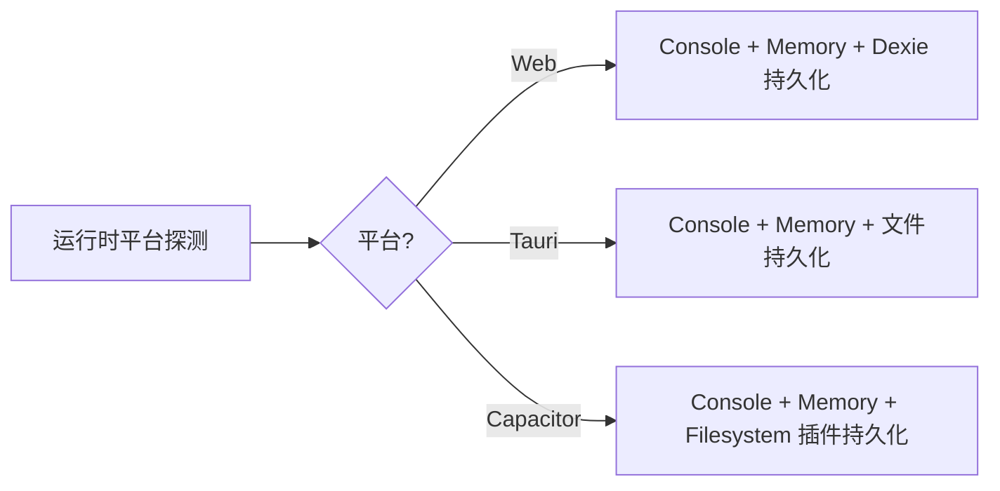
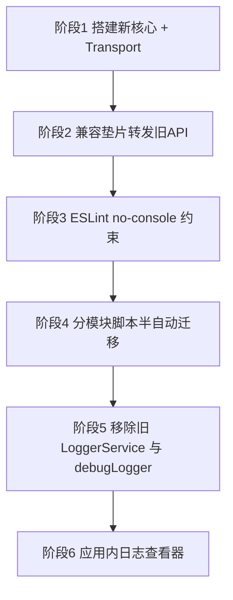

# AetherLink 全新统一日志系统 — 架构设计方案

> 状态：设计稿（待评审）
> 适用范围：Web / Tauri 桌面端 / Capacitor 移动端（Android、iOS、HarmonyOS）
> 目标：用一套统一、可分级、可扩展、生产零开销的日志系统，替换当前碎片化的日志现状。

---

## 1. 背景与现状

### 1.1 现状盘点（实测数据）

| 日志方式 | 数量 | 占比 | 说明 |
|---------|------|------|------|
| 裸 `console.*`（log/error/warn/info/debug） | 约 3040 处 | 约 99% | 散落全线，无分级、无开关、生产照样打印 |
| `LoggerService`（`infra/LoggerService.ts`） | 约 30 处（19 个文件导入） | 小于 1% | 仅网络层/API 层使用 |
| `debugLog`（`utils/debugLogger.ts`） | 10 处 | 小于 1% | 几乎无人使用 |

### 1.2 核心问题

1. **三套体系并存且互不相干**，没有统一入口。
2. **设计较好的 `LoggerService` 未被推广**，覆盖率不足 1%。
3. **99% 是裸 console**，导致：
   - 生产构建全量输出，泄露信息、拖慢性能；
   - 前缀 `[模块名]` 全靠手写约定，风格不统一；
   - 无法集中控制级别、开关、过滤、采集上报；
   - 移动端/桌面端线上问题难以排查（日志拿不到）。

### 1.3 现有 `LoggerService` 可复用的优点

- 已有 `LogLevel` 分级（DEBUG/INFO/WARN/ERROR）；
- 已有内存缓存 + 防抖持久化到 Dexie（保留最近 100 条）；
- 已有 `getRecentLogs` / `clearLogs` 查询接口；
- 已有 `logApiRequest` / `logApiResponse` 专用方法。

> 新系统将继承这些优点，并扩展为多端、多 Transport、命名空间化的完整体系。

---

## 2. 设计目标

| 目标 | 描述 |
|------|------|
| 统一入口 | 全项目唯一 `logger`，废弃裸 console 与旧两套工具 |
| 分级可控 | 运行时可调级别阈值，按环境/模块差异化 |
| 命名空间 | `logger.withContext('MCP')` 自动前缀，告别手写 `[xxx]` |
| 多端适配 | Web / Tauri / Capacitor 自动选择合适的输出与持久化通道 |
| 可扩展 Transport | 控制台、内存环形缓冲、持久化、远程上报互相解耦 |
| 生产零开销 | 生产剥离 DEBUG/TRACE，或级别阈值短路，性能无损 |
| 平滑迁移 | 兼容垫片转发旧 API，避免一次性改 3000 处 |
| 可排查 | 日志可在应用内查看、导出、按级别/模块过滤 |

---

## 3. 整体架构

### 3.1 分层结构



### 3.2 目录结构（建议）

```
src/shared/services/infra/logger/
├── index.ts              # 统一出口：export const logger, createLogger, 类型
├── Logger.ts             # 核心类：分级、命名空间、上下文、分发
├── types.ts              # LogLevel / LogEntry / Transport / LoggerConfig 接口
├── config.ts             # 默认级别阈值、环境判断、运行时开关读写
├── transports/
│   ├── ConsoleTransport.ts   # 彩色/前缀的控制台输出
│   ├── MemoryTransport.ts    # 环形缓冲（替代当前固定 100 条）
│   ├── PersistTransport.ts   # 持久化（按平台选 Dexie/文件）
│   └── RemoteTransport.ts    # 可选：远程上报（预留）
└── compat.ts             # 兼容垫片：转发旧 LoggerService / debugLog 签名
```

---

## 4. 核心 API 设计

### 4.1 日志级别

```
SILENT = 0   // 关闭所有
ERROR  = 1
WARN   = 2
INFO   = 3
DEBUG  = 4
TRACE  = 5   // 最详细
```

- 仅当 `entry.level <= currentThreshold` 时才输出（数值越小越重要）。
- 默认阈值：开发环境 `DEBUG`，生产环境 `WARN`。

### 4.2 主要接口（伪代码，仅描述形态）

```ts
// 全局单例
logger.error(message, ...args)
logger.warn(message, ...args)
logger.info(message, ...args)
logger.debug(message, ...args)
logger.trace(message, ...args)

// 命名空间工厂（推荐业务使用）
const log = logger.withContext('MCP')
log.info('调用工具', { tool, args })   // 输出 [MCP] 调用工具 ...

// 运行时控制
logger.setLevel('DEBUG')
logger.getLevel()

// 查询与导出（应用内日志查看器使用）
logger.getRecentLogs(count?)
logger.exportLogs(format)   // json / text
logger.clearLogs()

// 专用方法（继承现有能力）
logger.logApiRequest(endpoint, level, data)
logger.logApiResponse(endpoint, statusCode, data)
```

### 4.3 LogEntry 结构

```ts
interface LogEntry {
  timestamp: number      // epoch ms
  level: LogLevel
  context?: string       // 命名空间，如 'MCP'
  message: string
  args?: unknown[]        // 附加数据
  platform: 'web' | 'tauri' | 'capacitor'
}
```

---

## 5. Transport 设计

| Transport | 职责 | 默认启用 | 备注 |
|-----------|------|---------|------|
| ConsoleTransport | 输出到浏览器/原生控制台，带颜色与前缀 | 是 | 生产可按级别裁剪 |
| MemoryTransport | 环形缓冲（如最近 500 条），供应用内查看器 | 是 | 替代当前固定 100 条 Dexie 缓存 |
| PersistTransport | 持久化到磁盘/IndexedDB，供导出与崩溃排查 | 可选 | 平台适配见 6 |
| RemoteTransport | 上报到远端（如 Sentry/自建） | 否（预留） | 需用户授权 |

- 每个 Transport 实现统一接口 `write(entry: LogEntry): void | Promise<void>`。
- Transport 各自维护级别阈值（如 Console 输 DEBUG，Persist 仅存 INFO 以上）。

---

## 6. 多端适配策略



| 平台 | 控制台 | 持久化方案 | 导出方式 |
|------|--------|-----------|---------|
| Web | DevTools Console | IndexedDB（复用 Dexie） | 浏览器下载 |
| Tauri 桌面 | WebView Console + 可选 Rust 端 | 文件系统（app log 目录） | 打开日志文件/目录 |
| Capacitor 移动 | Logcat/Xcode Console | Filesystem 插件写文件 | 分享/导出文件 |

> 平台探测复用现有 `isTauri()` 与 `Capacitor.isNativePlatform()` 工具。

---

## 7. 生产环境零开销

两种手段叠加：

1. **构建期剥离**：Vite/esbuild 配置 `drop` 或自定义插件，在生产构建移除 `logger.debug` / `logger.trace` 调用（需保证调用形态可被静态识别）。
2. **运行期短路**：级别阈值在最外层判断，未达阈值的日志直接 return，不做字符串拼接与序列化。

> 建议优先依赖运行期短路（实现简单、行为可预期），构建期剥离作为进阶优化。

---

## 8. 迁移策略（分阶段）



### 阶段说明

1. **阶段1 — 搭建新核心**：实现 `logger/` 目录全部模块，独立可用，不影响现有代码。
2. **阶段2 — 兼容垫片**：`compat.ts` 让旧 `LoggerService.log()` 与 `debugLog.*` 转发到新系统；19 个旧文件无需立即改动。
3. **阶段3 — ESLint 约束**：开启 `no-console`（允许 `error`/`warn` 或完全禁止），新代码强制走 `logger`。
4. **阶段4 — 分模块迁移**：编写 codemod 脚本，按目录批量把 `console.xxx('[Mod] ...')` 替换为 `createLogger('Mod').xxx(...)`，逐模块验证。
5. **阶段5 — 清理**：迁移完成后删除旧 `LoggerService.ts`、`debugLogger.ts`，移除垫片。
6. **阶段6 — 日志查看器**：在设置页增加日志查看/过滤/导出界面（可选增强）。

### 迁移优先级建议

- 高优先：`shared/services/*`、`shared/store/*`、`shared/api/*`（核心链路，日志量大）。
- 中优先：`shared/utils/*`、`hooks/*`。
- 低优先：`components/*`、`pages/*`（UI 层，日志相对次要）。

---

## 9. 风险与对策

| 风险 | 对策 |
|------|------|
| 3000 处迁移工作量大 | codemod 脚本半自动 + 分模块分批，垫片兜底不阻塞 |
| 构建期剥离误删 | 优先用运行期短路，剥离作为可选项并充分测试 |
| 移动端文件写入权限/性能 | PersistTransport 异步 + 节流；权限失败降级为仅内存 |
| 循环依赖（logger 依赖 storage，storage 又打日志） | logger 核心零业务依赖；持久化通过延迟注入/事件解耦 |
| 日志包含敏感信息（API Key 等） | 增加脱敏钩子，序列化前过滤敏感字段 |

---

## 10. 待决策项（评审时确认）

1. 是否需要 **持久化到文件**（Tauri/移动端线上排查）？还是内存缓冲即可？
2. 是否需要 **远程上报**（RemoteTransport）？若需要，目标服务（Sentry/自建）？
3. ESLint `no-console` 力度：**完全禁止** 还是 **保留 error/warn**？
4. 是否需要 **应用内日志查看器**（阶段6）？
5. 生产环境是否启用 **构建期剥离**，还是只用运行期级别短路？
6. 命名空间风格：`createLogger('MCP')` 还是 `logger.withContext('MCP')`，或两者都提供？

---

## 11. 下一步

评审通过后，切换到 Code 模式按阶段实施。建议首批交付：阶段 1（核心）+ 阶段 2（垫片）+ 阶段 3（ESLint），即可让新代码立即受益且不破坏现状。
